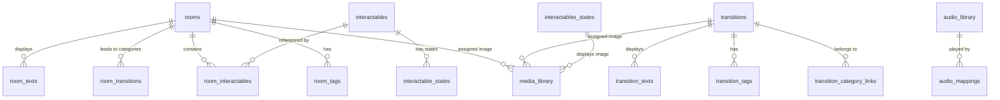

# Analiza Architektury Panelu Admina i Silnika LiminalOS

Dokument ten zawiera szczegółową analizę kodu panelu administratora oraz powiązanych mechanizmów w silniku gry `LiminalOS`. Analiza ta ma na celu przedstawienie struktury plików, zależności bazodanowych, mechaniki przejść, efektów interakcji, systemu audio i tagów, aby ułatwić planowanie przyszłej restrukturyzacji projektu.

---

## 1. Z Czego Składa się Panel Admina

Panel admina został zaprojektowany jako aplikacja typu **Single Page Application (SPA)** zintegrowana z backendowym API w języku PHP i bazą danych SQLite.

### A. Struktura Plików Panelu Admina (`/admin`)
*   `index.php` – Główny widok HTML i punkt wejściowy. Odpowiada za autoryzację sesji (hasło pobierane z `.env` lub domyślne `liminal_secret_99`) oraz renderuje interfejs panelu.
*   `script.js` – Logika kliencka panelu. Odpowiada za nawigację (opartą na hashu URL), pobieranie i wysyłanie danych do API, budowanie formularzy dynamicznych, podgląd multimediów oraz obsługę modalnych okien edycji (np. warunków przejść).
*   `style.css` – Arkusz stylów definiujący mroczną, szklaną estetykę panelu (glassmorphism, animowane tosty, retro monospaced detale).
*   `api.php` – Router API i kontroler operacji na bazie danych SQLite (`world_data/database.sqlite`). Udostępnia endpointy zarówno dla panelu (POST do zapisu), jak i publiczne endpointy GET dla klienta gry (pobieranie całego świata oraz mapowań dźwiękowych).
*   `image_utils.php` – Skrypt pomocniczy odpowiedzialny za przetwarzanie wgrywanych obrazów (skalowanie, kompresja i generowanie miniatur w locie przy użyciu biblioteki GD).
*   `data_sync.php` – Moduł walidacji i synchronizacji danych. Umożliwia import/export całej bazy w formacie JSON oraz podgląd różnic (diff) przed zatwierdzeniem zmian w bazie.
*   `import_template.json` – Szablon struktury danych do importu lokacji.

### B. Widoki Interfejsu Panelu Admina
1.  **Dashboard (World Overview):** Lista pokoi z dynamicznymi wskaźnikami wejścia/wyjścia (reachability) oraz modułem sprawdzania spójności grafu (World Integrity Check), który wykrywa ślepe zaułki i izolowane strefy za pomocą przeszukiwania BFS.
2.  **Media Library (Biblioteka Mediów):** Przeglądanie, wyszukiwanie, tagowanie i wgrywanie obrazów powiązanych z pokojami, przejściami lub obiektami.
3.  **Editor (Edytor Pokoju):** Formularz definiujący unikalne ID pokoju, nazwę, opis, przypisane obrazy, tagi ambiance, dozwolone kategorie przejść (z opcją warunków), przypisane interaktywne obiekty oraz teksty atmosferyczne.
4.  **Interactables View & Editor (Widok i Edytor Obiektów):** Tworzenie obiektów, definiowanie ich stanów logicznych (np. `on`, `off`, `flickering`), opisów i przypisanych do nich zasobów graficznych.
5.  **Transitions View & Editor (Widok i Edytor Przejść):** Definiowanie korytarzy/portali stanowiących przejścia między lokacjami.
6.  **System Config (Taxonomy):** Zarządzanie słownikami tagów pokoi, kategorii przejść i tagów przejść.
7.  **SFX Engine (Zarządzanie SFX):** Ingestia plików audio oraz interfejs do mapowania dźwięków na kategorie: BGM (tło muzyczne dla pokoi), States (dźwięki otoczenia obiektów), Transitions (dźwięki portali) oraz UI (kliknięcia, przejścia widoków).

---

## 2. Zależności między Plikami, Miejscami i Przejściami

Relacje w bazie danych SQLite są kluczem do zrozumienia, w jaki sposób powiązane są pliki multimedialne, pokoje (Locations) oraz przejścia (Transitions).

### A. Schemat Relacji Bazodanowych
Baza składa się z powiązanych ze sobą tabel:

### B. Kluczowa Architektura: Pokój $\rightarrow$ Kategoria $\rightarrow$ Przejście
Gra nie definiuje sztywnego połączenia typu `Pokój A -> Przejście X -> Pokój B`. Połączenie jest proceduralne:
1.  **Pokój** wskazuje dozwolone **Kategorie Przejść** (np. `industrial`, `liminal`), a nie konkretne przejścia.
2.  Tabela `transitions` określa konkretne instancje przejść (np. `industrial_elevator_01`) i przypisuje je do danej kategorii poprzez tabelę `transition_category_links`.
3.  **Algorytm Spanning-Tree (`mapgen.js`):** 
    *   Podczas inicjalizacji sesji silnik gry buduje graf połączeń lokacji na żądanie. 
    *   Gwarantuje on pełną osiągalność każdego pokoju z punktu startowego (`lobby`) za pomocą drzewa rozpinającego.
    *   Gwy algorytm tworzy połączenie wyjściowe z danego pokoju, sprawdza dozwolone kategorie przejść zdefiniowane dla tego pokoju.
    *   Następnie funkcja `_pickTransition(fromRoom, toRoom)` losuje jedno konkretne przejście przypisane do tej kategorii i tworzy instancję `TransitionLocation`.

---

## 3. Jak Działają Efekty Dodatkowe (State Effects)

Zasada działania efektów dodatkowych opiera się na **stanach obiektów interaktywnych**. 
Gdy gracz kliknie obiekt interaktywny w pokoju, jego stan w `state.worldStates[interactableId]` ulega zmianie. Każdy stan w definicji obiektu (`interactables.json` / tabela `interactable_states`) może posiadać tablicę `effects`.

### A. Typy Obsługiwanych Efektów (`app.js` $\rightarrow$ `processEffects`):
1.  **`sfx` / `sound`:**
    *   Odtwarza konkretny jednorazowy plik dźwiękowy (np. syczenie pary, kliknięcie przekaźnika) pobierany z bazy SFX gry.
2.  **`sanity`:**
    *   Modyfikuje poziom poczytalności gracza (np. wartość `+15` przy napiciu się wody migdałowej lub `-10` przy aktywacji niepokojącego urządzenia).
3.  **`glitch`:**
    *   Wymusza chwilowe, silne zakłócenia wizualne ekranu (modyfikacja parametrów filtra SVG w locie) o zadanej intensywności i czasie trwania.
4.  **`move`:**
    *   Wymusza natychmiastowe przeniesienie gracza (teleportację) do innego zdefiniowanego pokoju.
5.  **`act` / `interactable`:**
    *   Zmienia zdalnie stan innego obiektu interaktywnego (umożliwia to tworzenie systemów zależności, np. włączenie zasilania odblokowuje terminal w innym rogu pokoju).
6.  **`item`:**
    *   Dodaje lub usuwa przedmioty z ekwipunku gracza (np. dodanie `almond_water` do ekwipunku) i wypisuje odpowiedni komunikat w logu terminala.

---

## 4. Jak są Przypisywane Efekty Dźwiękowe

Silnik audio (`audio.js`) dzieli dźwięki na cztery logiczne warstwy i zarządza nimi na podstawie mapowań pobieranych z tabeli `audio_mappings`:

### A. Warstwy Audio
1.  **BGM (Background Music):**
    *   Ciągłe, zapętlone dźwięki otoczenia powiązane bezpośrednio z ID pokoju (np. cichy szum wentylacji dla `lobby`). Podczas zmiany pokoju następuje płynne przenikanie (crossfade) trwające 3 sekundy.
2.  **States (SFX Dźwięków Otoczenia):**
    *   Dźwięki generowane przez konkretne stany obiektów w pokoju. Gdy obiekt wchodzi w dany stan (np. `lobby_light` $\rightarrow$ `flickering`), silnik sprawdza mapowanie dźwiękowe dla kontekstu `lobby_light.flickering` i uruchamia zapętlony dźwięk brzęczenia. Jeśli brak dedykowanego pliku, uruchamiane jest proceduralne generowanie dźwięku za pomocą Web Audio API (np. oscylator kwadratowy 120Hz modulowany szumem).
3.  **Transitions (Dźwięki Przejść):**
    *   Dźwięk odtwarzany w momencie wejścia w strefę przejściową (np. odgłos zamykających się drzwi windy przy opuszczaniu pokoju). Mapowany pod ID przejścia.
4.  **UI (Systemowe):**
    *   Dźwięki interfejsu klienta gry (np. `btn_click`, `keypress`, `success`, `error`, `glitch`).

### B. Proceduralny Dobór Dźwięków po Tagach
Jeżeli wchodzimy do pokoju, silnik sprawdza jego słownik tagów ambiance. Wywołanie `playMatchingSfx(roomTags)` przeszukuje bazę efektów dźwiękowych w manifestach audio:
*   Każdy zarejestrowany efekt dźwiękowy ma listę przypisanych tagów.
*   Gra wylicza tzw. *overlap* – liczbę wspólnych tagów między pokojem a efektem dźwiękowym.
*   Odtwarzany jest dźwięk o największej liczbie pasujących tagów, co pozwala na automatyczne dopasowanie klimatu dźwiękowego bez ręcznego konfigurowania każdego pokoju.

---

## 5. Jak Działa System Tagów

System tagów pełni rolę elastycznego spoiwa wiążącego dane graficzne, tekstowe i dźwiękowe bez twardego kodowania zależności w klasach JS.

### A. Rodzaje Tagów w Systemie
1.  **Tagi Pokoi (Room Tags):**
    *   Określają atmosferę miejsca (np. `industrial, dark, wet, noisy`). Służą do filtrowania i dynamicznego dobierania losowych efektów dźwiękowych przy wejściu do pokoju.
2.  **Tagi Przejść (Transition Tags):**
    *   Określają rodzaj poruszania się (np. `elevator, stairs, corridor, crawlspace`).
3.  **Tagi Mediów (Media Tags):**
    *   Zapisane w bibliotece multimediów (np. `assigned, room, transition`). Pomagają filtrować pliki w panelu administratora oraz informują, czy dany obrazek jest aktualnie w użyciu.

### B. Definicje Systemowe (Taxonomy Definitions)
W panelu administratora w sekcji **System Config** znajduje się słownik dozwolonych pojęć (`taxonomy_definitions`). 
*   Zarejestrowanie tagu w tym miejscu sprawia, że staje się on globalnie widoczny i ułatwia unifikację nazewnictwa.
*   Usunięcie tagu ze słownika w panelu usuwa definicję pomocniczą, lecz ze względów bezpieczeństwa nie modyfikuje zapisanych pokoi ani obiektów, chroniąc przed utratą danych.
*   Dzięki tagom, baza mediów automatycznie dopasowuje obrazy tła do przejść z danej kategorii – jeśli konkretne przejście nie ma dedykowanego obrazu, silnik szuka w indeksie obrazów oznaczonych tagiem danej kategorii jako fallback.

---

## Podsumowanie i Wnioski do Restrukturyzacji

Obecny panel administratora łączy w sobie cechy systemu zarządzania bazą danych (SQLite) z silnikiem renderującym grę. Główne obszary problematyczne to:
*   **Brak modularności formularzy:** Formularze edycji pokoju, przejść i obiektów interaktywnych w `script.js` opierają się na ręcznym budowaniu kodu HTML wewnątrz JS za pomocą template strings (`addStateField`, `addTextField`).
*   **Mieszanie logiki bazy z logiką gry:** Definicje przejść są rozproszone pomiędzy bazą SQLite a plikami JSON (`transitions.json`), co utrudnia synchronizację i spójność danych.
*   **Niejednorodne mapowanie mediów:** Obrazy pokoi są indeksowane w `media_library` i mapowane poprzez `context_id`, podczas gdy ikony stanów obiektów mają zapisane ścieżki bezpośrednio w tabeli stanów jako atrybut `image`.

Zaleca się wydzielenie w przyszłej strukturze osobnych modułów renderowania formularzy (np. w oparciu o komponenty lub prosty system szablonów), pełne przeniesienie konfiguracji przejść do SQLite oraz ujednolicenie indeksowania plików multimedialnych.
