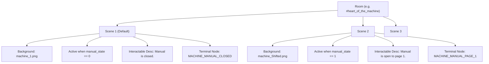
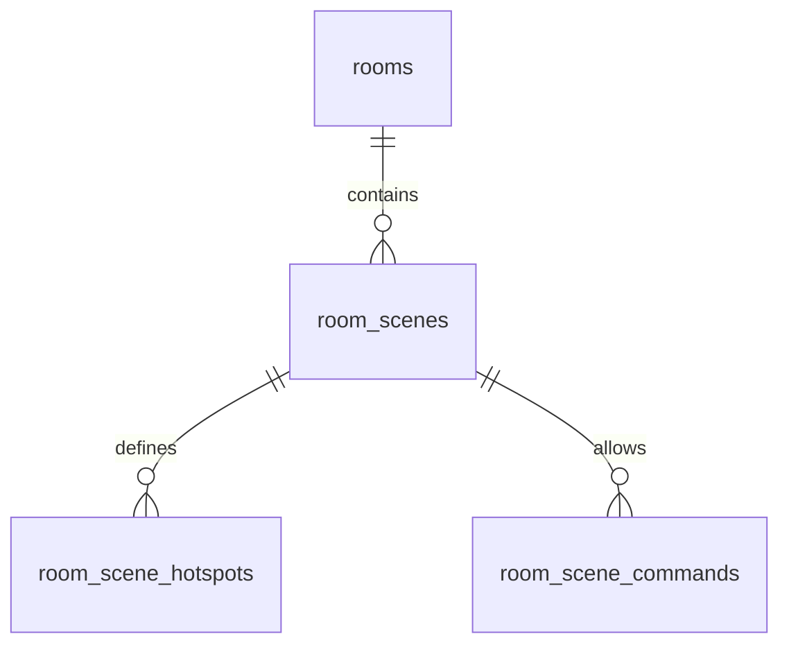

# Architecture Design Report: State-Dependent Visual Scenes, Dialogues & Terminal Actions

## 1. Executive Summary
As LiminalOS grows, the relationship between narrative state, player actions, and location visuals becomes more complex. The current system models a room as a flat list of transitions, interactables, and background media. 

To support advanced scenarios—where a single room's background image, exits, dialogue choices, terminal actions, and interactable descriptions change dynamically based on the state of items or world variables (e.g., `#heart_of_the_machine` shifting instruction manual states)—we propose a transition from **Flat Room Definitions** to a **Scene-Based State Machine Model**.

---

## 2. Core Concepts: The "Sub-Scene" Model

Instead of a room having a static background and a flat list of hotspots, a **Room** is composed of one or more **Scenes** (or frames).



### Key Rules:
1. **State Isolation**: Each scene owns a background graphic, its own list of transition and interactable hotspots, its custom narrative description, and associated terminal dialogue trees.
2. **Declarative Evaluation**: The game client evaluates which scene is active by matching the player's current world state against each scene's visibility requirements.
3. **Dynamic Dialogue Routing**: When a sub-scene changes, the terminal automatically routes its active options to the dialogue node associated with that scene.

---

## 3. Data Schema Specifications

### 3.1 Extended Room JSON Schema
The following JSON structure shows how a room is serialized to support multiple sub-scenes, narrative descriptions, and dialogue hooks:

```json
{
  "id": "heart_of_the_machine",
  "name": "Heart of the Machine",
  "desc": "A claustrophobic basement level filled with the smell of rust and coal dust.",
  "scenes": [
    {
      "id": "manual_closed",
      "is_default": true,
      "bg_image": "rooms/machine/core_closed.png",
      "requirements": {
        "world_states": {
          "shifting_instruction_manual": 0
        }
      },
      "interactable_desc": "A heavy iron desk sits in the corner. Upon it rests the shifting instruction manual, its cover shut tight.",
      "dialogue_id": "MACHINE_MANUAL_CLOSED",
      "terminal_commands": [
        {
          "trigger": "READ MANUAL",
          "effects": [
            { "type": "act", "id": "shifting_instruction_manual", "state": 1 },
            { "type": "sfx", "value": "success" }
          ],
          "success_text": "You approach the desk and open the manual to the first page. A strange blue light begins to glow from the diagrams."
        }
      ],
      "hotspots": [
        {
          "type": "act",
          "target_id": "shifting_instruction_manual",
          "label": "Open Manual",
          "area": {
            "shapes": [{ "type": "rect", "coords": { "x": 20, "y": 45, "width": 15, "height": 10 } }]
          }
        }
      ]
    },
    {
      "id": "manual_page_1",
      "is_default": false,
      "bg_image": "rooms/machine/core_open_blue.png",
      "requirements": {
        "world_states": {
          "shifting_instruction_manual": 1
        }
      },
      "interactable_desc": "The manual is open on the desk, glowing with a soft blue light. The diagrams shift and writhe like veins.",
      "dialogue_id": "MACHINE_MANUAL_PAGE_1",
      "terminal_commands": [
        {
          "trigger": "TURN PAGE",
          "effects": [
            { "type": "act", "id": "shifting_instruction_manual", "state": 2 },
            { "type": "sfx", "value": "success" }
          ],
          "success_text": "You turn the heavy page. The blue light fades into a frantic, pulsing red glare."
        }
      ],
      "hotspots": [
        {
          "type": "act",
          "target_id": "shifting_instruction_manual",
          "label": "Turn Page",
          "area": {
            "shapes": [{ "type": "rect", "coords": { "x": 20, "y": 45, "width": 15, "height": 10 } }]
          }
        }
      ]
    },
    {
      "id": "manual_page_2",
      "is_default": false,
      "bg_image": "rooms/machine/core_open_red.png",
      "requirements": {
        "world_states": {
          "shifting_instruction_manual": 2
        }
      },
      "interactable_desc": "The manual is open on page 2. Frantic scrawling covers the margins: 'DO NOT TRIGGER VALVE'.",
      "dialogue_id": "MACHINE_MANUAL_PAGE_2",
      "terminal_commands": [
        {
          "trigger": "CLOSE MANUAL",
          "effects": [
            { "type": "act", "id": "shifting_instruction_manual", "state": 0 },
            { "type": "sfx", "value": "success" }
          ],
          "success_text": "You slam the manual shut, plunging the room back into darkness."
        }
      ],
      "hotspots": [
        {
          "type": "act",
          "target_id": "shifting_instruction_manual",
          "label": "Close Manual",
          "area": {
            "shapes": [{ "type": "rect", "coords": { "x": 20, "y": 45, "width": 15, "height": 10 } }]
          }
        }
      ]
    }
  ]
}
```

---

## 4. SQLite Database Mappings
To maintain relational integrity, we extend the current database structure by introducing a `room_scenes` table.



### Table Schemas:

#### `room_scenes`
| Column | Type | Constraints | Description |
| :--- | :--- | :--- | :--- |
| `id` | VARCHAR | PRIMARY KEY | Unique scene identifier (e.g. `manual_closed`) |
| `room_id` | VARCHAR | FOREIGN KEY REFERENCES `rooms(id)` ON DELETE CASCADE | Associated room container |
| `is_default` | INT | DEFAULT 0 | 1 = Default scene if requirements aren't met |
| `media_id` | INTEGER | FOREIGN KEY REFERENCES `media_library(id)` | Background image asset ID |
| `interactable_desc` | TEXT | - | Custom text override for `#interactable-desc` |
| `dialogue_id` | VARCHAR | - | Dialogue tree state node ID |
| `requirements` | TEXT | JSON Allowed | World state requirements to view this scene |

#### `room_scene_commands`
| Column | Type | Constraints | Description |
| :--- | :--- | :--- | :--- |
| `id` | INTEGER | PRIMARY KEY AUTOINCREMENT | Unique command ID |
| `scene_id` | VARCHAR | FOREIGN KEY REFERENCES `room_scenes(id)` ON DELETE CASCADE | Parent scene node |
| `trigger` | VARCHAR | - | Terminal string match trigger (e.g. `READ MANUAL`) |
| `effects` | TEXT | JSON Allowed | Event effects array |
| `success_text`| TEXT | - | Terminal response string on execute |

---

## 5. Client Execution Engine Changes

### 5.1 Resolving Scene & Updating `#interactable-desc` (`app.js`)
On room entry or state change, the client evaluates which sub-scene is active, rendering its description dynamically:

```javascript
class SceneResolutionEngine {
    constructor(game) {
        this.game = game;
    }

    resolveActiveScene(roomDef) {
        const validScenes = (roomDef.scenes || []).filter(scene => {
            if (scene.is_default) return false;
            return this.game.checkRequirements(scene.requirements);
        });

        if (validScenes.length > 0) return validScenes[0];
        return roomDef.scenes.find(s => s.is_default) || roomDef.scenes[0];
    }

    renderRoom(roomId) {
        const roomDef = this.game.world.rooms[roomId];
        const activeScene = this.resolveActiveScene(roomDef);

        // 1. Update background graphic
        document.getElementById('scene-bg').src = this.game.resolveImagePath(activeScene.bg_image);

        // 2. Render State-Dependent Description in #interactable-desc
        const descEl = document.getElementById('interactable-desc');
        if (descEl) {
            descEl.innerText = activeScene.interactable_desc || "";
        }

        // 3. Update the Terminal's active options based on the scene dialogue_id
        if (window.TerminalSystem) {
            window.TerminalSystem.showActiveDialogueOptions();
        }
    }
}
```

### 5.2 Terminal Option Routing & Commands (`terminal.js`)
The terminal checks the current scene for custom command triggers and dialogue IDs:

```javascript
// Inside showActiveDialogueOptions()
showActiveDialogueOptions() {
    let stateId = this.currentState;

    // 1. Prioritize active sub-scene dialogue ID if defined
    if (window.game) {
        const activeScene = window.game.getActiveScene();
        if (activeScene && activeScene.dialogue_id && this.dialogueTree[activeScene.dialogue_id]) {
            stateId = activeScene.dialogue_id;
        }
    }

    // Fallback to room dialogue or INITIAL
    const state = this.dialogueTree[stateId] || this.dialogueTree["INITIAL"];
    this.activeChoices = state.options || [];
    this.renderOptions(this.activeChoices);
}

// Inside handleInput(inputVal)
handleInput(inputVal) {
    const rawCmd = inputVal.trim();
    const cmd = rawCmd.toUpperCase();

    // 1. Check active sub-scene for custom command triggers first
    if (window.game) {
        const activeScene = window.game.getActiveScene();
        if (activeScene && activeScene.terminal_commands) {
            const matchedCmd = activeScene.terminal_commands.find(c => c.trigger.toUpperCase() === cmd);
            if (matchedCmd) {
                this.addToHistory("» " + rawCmd, 'user-input', '▸');
                if (matchedCmd.effects) {
                    window.game.processEffects(matchedCmd.effects);
                }
                if (matchedCmd.success_text) {
                    this.typeResponse(matchedCmd.success_text);
                }
                return;
            }
        }
    }

    // Fallback to standard dialogue options or command registry...
}
```

---

## 6. Dialogue Tree Integration Example (`terminal_dialogue.json`)
The following dialogue nodes correspond to the manual stages in the `#heart_of_the_machine` location:

```json
{
  "MACHINE_MANUAL_CLOSED": {
    "text": "THE SHIFTING MANUAL LIES CLOSED ON THE METALLIC DESK. RUST FLAKES FROM ITS CLIPS.",
    "options": [
      {
        "label": "READ THE MANUAL",
        "next": "INITIAL",
        "effects": [
          { "type": "act", "id": "shifting_instruction_manual", "state": 1 }
        ]
      }
    ]
  },
  "MACHINE_MANUAL_PAGE_1": {
    "text": "DIAGRAMS RESEMBLE CYCLING VALVES CONNECTED TO CORRUPT VEINS. THE CODE READS:\n1. VENT STEAM TO SECTION A.\n2. EQUALIZE FLUID PRESSURE.",
    "options": [
      {
        "label": "TURN PAGE",
        "next": "INITIAL",
        "effects": [
          { "type": "act", "id": "shifting_instruction_manual", "state": 2 }
        ]
      },
      {
        "label": "CLOSE MANUAL",
        "next": "INITIAL",
        "effects": [
          { "type": "act", "id": "shifting_instruction_manual", "state": 0 }
        ]
      }
    ]
  },
  "MACHINE_MANUAL_PAGE_2": {
    "text": "THE WORDS DISSOLVE INTO CHARRED INK: 'RUN. THE BOILER CANNOT HOLD. DO NOT TOUCH THE VALVES.'",
    "options": [
      {
        "label": "CLOSE MANUAL AND WALK AWAY",
        "next": "INITIAL",
        "effects": [
          { "type": "act", "id": "shifting_instruction_manual", "state": 0 }
        ]
      }
    ]
  }
}
```
