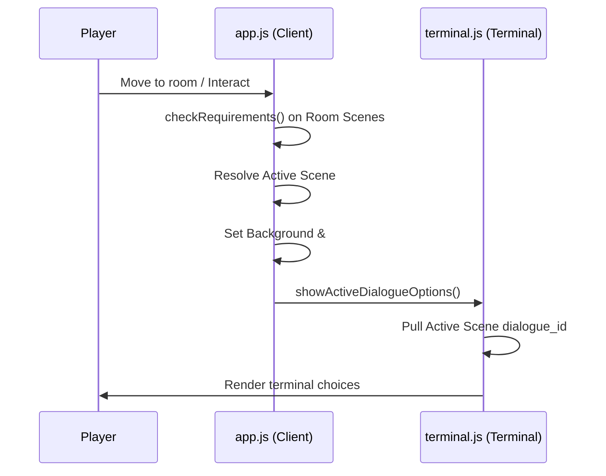

# Implementation Plan: Sub-Scene State Machine System

This document outlines the step-by-step procedure to implement state-dependent scenes, dialogues, dynamic descriptions, and terminal action commands in LiminalOS.

---

## Phase 1: Database Migration & Schema Creation
To persist the scene hierarchy without breaking backwards compatibility, we must create a structured set of tables and migrate existing flat data.

### 1.1 Database SQL Definition
Run the following SQL to define the new scene schema inside `world_data/database.sqlite`:

```sql
-- Create room_scenes table
CREATE TABLE IF NOT EXISTS room_scenes (
    id VARCHAR PRIMARY KEY,
    room_id VARCHAR NOT NULL,
    is_default INT DEFAULT 0,
    media_id INTEGER,
    interactable_desc TEXT,
    dialogue_id VARCHAR,
    requirements TEXT, -- JSON array of requirements
    FOREIGN KEY(room_id) REFERENCES rooms(id) ON DELETE CASCADE,
    FOREIGN KEY(media_id) REFERENCES media_library(id) ON DELETE SET NULL
);

-- Create room_scene_hotspots table
CREATE TABLE IF NOT EXISTS room_scene_hotspots (
    id INTEGER PRIMARY KEY AUTOINCREMENT,
    scene_id VARCHAR NOT NULL,
    type VARCHAR CHECK(type IN ('tra', 'act')),
    target_id VARCHAR NOT NULL,
    label VARCHAR,
    coords_json TEXT, -- JSON coordinates
    requirements TEXT, -- Gating requirements
    FOREIGN KEY(scene_id) REFERENCES room_scenes(id) ON DELETE CASCADE
);

-- Create room_scene_commands table
CREATE TABLE IF NOT EXISTS room_scene_commands (
    id INTEGER PRIMARY KEY AUTOINCREMENT,
    scene_id VARCHAR NOT NULL,
    trigger VARCHAR NOT NULL,
    effects TEXT, -- JSON array of effects
    success_text TEXT,
    FOREIGN KEY(scene_id) REFERENCES room_scenes(id) ON DELETE CASCADE
);
```

### 1.2 Migration Script (`tools/migrate_scenes.php`)
Create a migration script to:
1. Initialize the new tables.
2. Read existing tables (`room_transitions`, `room_interactables`, `rooms`).
3. For every room, insert a default scene:
   - `id` = `[room_id]_default`
   - `is_default` = 1
   - Fetch the current background image from `image_index` and map it to `media_id`.
   - Convert all existing room transitions and room interactables into records in `room_scene_hotspots`.
4. Delete old redundant relational mappings once verified.

---

## Phase 2: Backend API & Synchronization Updates

### 2.1 Update `admin/api.php`
- Modify the room fetch endpoint to query `room_scenes`, `room_scene_hotspots`, and `room_scene_commands` and pack them into a nested `scenes` array in the JSON response.
- Update the room saving logic:
  - Wrap database operations in a transaction.
  - Delete old scene rows associated with the target `room_id`.
  - Parse the `scenes` JSON array from the client payload and insert into `room_scenes`, `room_scene_hotspots`, and `room_scene_commands`.

### 2.2 Update `admin/data_sync.php`
- Update the import/export functionality to support the new database structures when dumping the JSON graph to `output.json`.

---

## Phase 3: Client Engine Refactoring (`app.js` & `terminal.js`)



### 3.1 Modify `app.js`
- Implement `getActiveScene(roomId)`:
  - Fetches the room definition.
  - Loops over the scenes. Evaluates requirements.
  - Returns the first matching scene, or falls back to the default scene.
- Update `renderRoom()`:
  - Resolves active scene.
  - Renders active scene background image.
  - Populates `this.elements.interactableDesc.innerText = activeScene.interactable_desc || ""`.
  - Invokes hotspot rendering for `activeScene.hotspots`.

### 3.2 Modify `terminal.js`
- Update `showActiveDialogueOptions()`:
  - Look up `window.game.getActiveScene()`.
  - If a `dialogue_id` is defined on the active scene, set `stateId = dialogue_id`.
- Update `handleInput()`:
  - Intercept the user input.
  - Check if the command matches a trigger in the active scene's `terminal_commands` list.
  - If matched, execute effects and display success text without executing standard commands.

---

## Phase 4: Admin Panel Interface Integration [COMPLETED]

### 4.1 Update Room Editor layout (`admin/js/rooms.js`) [COMPLETED]
- Add a new tab `Scenes Manager` next to the general details tab. [COMPLETED]
- Render a two-column interface: [COMPLETED]
  - **Left column**: List of scenes for the room, with buttons to add, delete, clone, or drag-order them.
  - **Right column**: Contextual editing forms for the selected scene:
    - Background Image Selector.
    - Description fields (Text, dynamic descriptions).
    - Requirements modal link.
    - Hotspots listing and drawing overlays.
    - Custom Terminal commands listing.

### 4.2 Canvas Drawing Tool Adaptation [COMPLETED]
- Pass the selected scene's background image URL to the coordinates drawing canvas. [COMPLETED]
- Store coordinates into `scene.hotspots[idx].area` directly. [COMPLETED]

---

## Phase 5: Verification & Testing

### 5.1 Unit Tests (`admin/run_tests.php`)
Add tests verifying:
1. **Scene Requirements Validation**: Ensures the scene resolution logic returns the correct scene based on mock world states.
2. **Dialogue Routing Test**: Verifies that when the instruction manual state is updated in the database, the active dialogue routes to the correct node.
3. **Database Cascading Integrity**: Verify deleting a room cascades to delete all associated scenes, scene hotspots, and custom commands.
