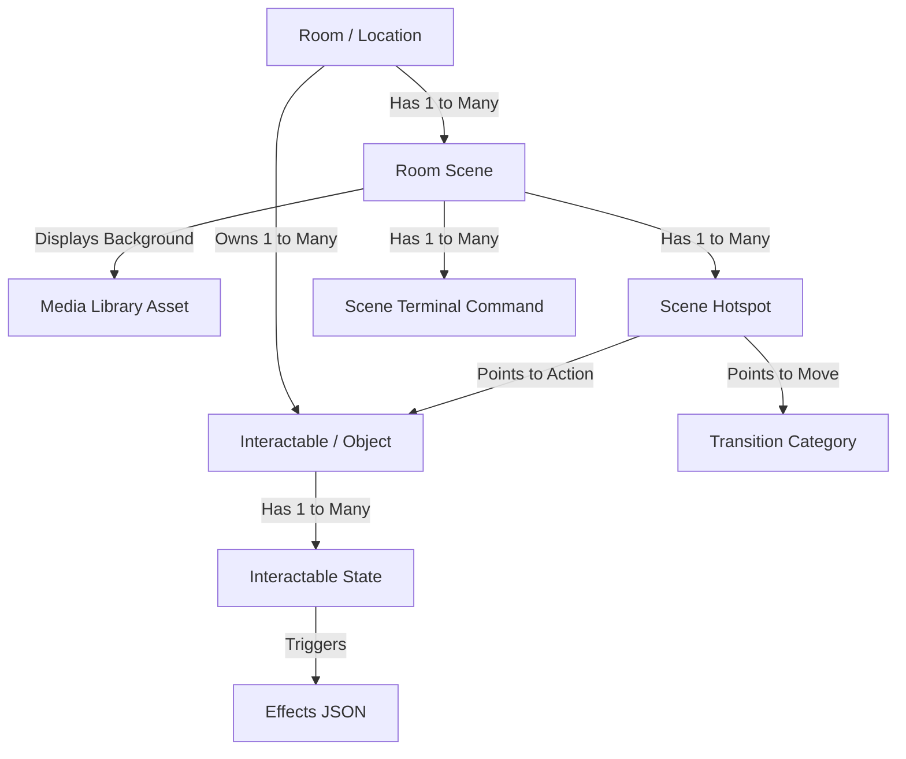

# Relationship Map: Rooms, Scenes, and Interactables

This report outlines the structural schema and runtime execution model mapping **Rooms (Locations)**, **Scenes**, and **Interactables** within the LiminalOS environment.

---

## 1. High-Level Concepts

### A. Room (Lokacja / Pomieszczenie)
The top-level container representing a geographical area in the game (e.g., `lobby`, `poolrooms_corridor`). 
- **Ownership**: A Room owns a set of specific **Interactables** (`1-to-Many`). It also owns a series of **Scenes** (`1-to-Many`) representing the room's visual and logical states.
- **Legacy Compatibility**: If a room does not have configured scenes, the runtime engine dynamically generates a virtual default scene mapping the room's direct attributes (transitions and interactables).

### B. Room Scene (Scena)
A specific visual and logical sub-state of a Room.
- **Visuals**: Tied to a background image (`media_library.id`).
- **Logic**: Linked to a terminal dialogue tree branch (`dialogue_id`) and console descriptions (`interactable_desc`).
- **Dynamic Switching**: A room can have multiple scenes (e.g., `lobby_dark` and `lobby_lit`). At runtime, the game engine evaluates each scene's entry conditions (`requirements`). The first scene with satisfied requirements is rendered. If none match, it falls back to the room's marked default scene.
- **Interactive Areas**: Contains **Hotspots** (clickable polygon coordinate coordinates on the background image).

### C. Interactable (Obiekt Interaktywny)
An interactive element that exists inside a specific Room.
- **Room-Bound**: Each interactable belongs to exactly one parent room (1-to-Many relation via `room_id`). It cannot be shared between rooms.
- **Logical States**: Has multiple states (e.g., `default`, `on`, `off`, `broken`) stored in `interactable_states` ordered by `sort_order`.
- **State Effects**: Each state can trigger game state mutations (e.g., modifying health/sanity, unlocking doors, adding items to inventory).
- **Physical Layout**: Mapped onto the screen coordinates of a Scene via a Hotspot of type `act` pointing to the interactable's ID.

---

## 2. Database Schema Relationships

Here is the exact layout of the SQLite database tables and foreign key relationships linking these entities:

### `rooms`
*Defines the abstract locations.*
| Column | Type | Description |
| :--- | :--- | :--- |
| `id` (PK) | `TEXT` | Unique ID of the room (e.g., `lobby`) |
| `name` | `TEXT` | Human-readable name (e.g., `Lobby Area`) |
| `desc` | `TEXT` | Generic room description |
| `effects` | `TEXT` | Room-level global JSON effects |

### `room_scenes`
*Defines the different states/views of a room.*
| Column | Type | Foreign Key / Constraint | Description |
| :--- | :--- | :--- | :--- |
| `id` (PK) | `TEXT` | | Unique ID of the scene (e.g., `lobby_default`) |
| `room_id` | `TEXT` | `REFERENCES rooms(id) ON DELETE CASCADE` | The parent room |
| `is_default` | `INTEGER` | `DEFAULT 0` | 1 if this is the default fallback scene |
| `media_id` | `INTEGER` | `REFERENCES media_library(id) ON DELETE SET NULL` | The background image |
| `interactable_desc`| `TEXT` | | CLI/Console output text when inspect command is used |
| `dialogue_id` | `TEXT` | | Connected terminal dialogue tree branch ID |
| `requirements` | `TEXT` | | JSON string representing requirements to load this scene |

### `room_scene_hotspots`
*Maps clickable graphical regions on a scene to actions or movements.*
| Column | Type | Foreign Key / Constraint | Description |
| :--- | :--- | :--- | :--- |
| `id` (PK) | `INTEGER` | | Autoincrement key |
| `scene_id` | `TEXT` | `REFERENCES room_scenes(id) ON DELETE CASCADE` | The parent scene |
| `type` | `TEXT` | `CHECK(type IN ('tra', 'act'))` | `'tra'` (Transition) or `'act'` (Interactable Action) |
| `target_id` | `TEXT` | | ID of transition category or interactable |
| `label` | `TEXT` | | User tooltip/description |
| `coords_json` | `TEXT` | | Polygon coordinate percentages (e.g. `[ [10, 20], [30, 40] ... ]`) |
| `requirements` | `TEXT` | | Specific conditions required to click/trigger this hotspot |

### `interactables`
*The logic of an interactive object.*
| Column | Type | Foreign Key / Constraint | Description |
| :--- | :--- | :--- | :--- |
| `id` (PK) | `TEXT` | | Unique ID (e.g., `lobby_light`) |
| `room_id` | `TEXT` | `REFERENCES rooms(id) ON DELETE CASCADE` | Owner room |
| `label` | `TEXT` | | Label (e.g. `Old Switchboard`) |
| `requirements` | `TEXT` | | Global requirements to interact with the object |
| `current_state_index`| `INTEGER` | `DEFAULT 0` | Current active state index |

### `interactable_states`
*Defines states for an interactable.*
| Column | Type | Foreign Key / Constraint | Description |
| :--- | :--- | :--- | :--- |
| `id` (PK) | `INTEGER` | | Autoincrement key |
| `interactable_id`| `TEXT` | `REFERENCES interactables(id) ON DELETE CASCADE` | Parent object |
| `state_id` | `TEXT` | | State identifier (e.g., `off`) |
| `desc` | `TEXT` | | Log output when entering this state |
| `image` | `TEXT` | | State-specific custom visual asset filepath |
| `sort_order` | `INTEGER` | | Index sorting order |
| `effects` | `TEXT` | | JSON payload of mutations triggered |

---

## 3. Runtime Resolution Mechanics

The client game engine (`app.js`) handles these elements during gameplay using the following logic:

### A. Entering a Room (Change Location)
1. **Scene Selection (`getActiveScene(roomId)`)**:
   - The engine retrieves all scenes configured for the target room.
   - It iterates through non-default scenes, evaluating their `requirements` payload against the current game state (e.g., verifying if `lobby_light` state is `on`).
   - The **first matching scene** is loaded.
   - If no custom scene matches, the **default scene** (where `is_default = 1`) is loaded.
2. **Drawing Graphics & Interactions**:
   - The background image of the selected scene is drawn.
   - Clickable polygon regions are created based on the scene's `room_scene_hotspots`.
   - Tooltips are mapped using the hotspot's `label`.

### B. Clicking an Interactable Hotspot
1. The user clicks a region representing an interactable (type `'act'`).
2. The engine checks the hotspot's `requirements`. If met, it proceeds.
3. It resolves the targeted `interactable_id`.
4. It advances the object's `current_state_index` (cycling states or executing scripted transitions).
5. It triggers state `effects` (mutates player metrics, drops items, etc.).
6. Because the game state changed, the engine re-evaluates `getActiveScene(roomId)`:
   - If a new scene's requirements are now met (e.g. light is now ON), the game dynamically switches the background image and hotspots to match the new scene.
