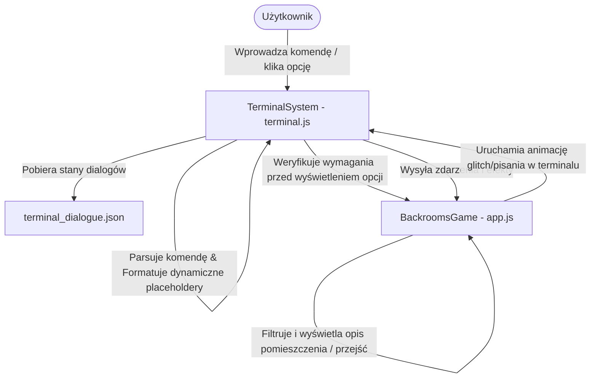

# Dokumentacja Architektury Terminala LiminalOS

Terminal LiminalOS to zintegrowany, tekstowy interfejs użytkownika (CLI) połączony bezpośrednio z silnikiem gry `BackroomsGame`. Niniejszy dokument opisuje architekturę terminala, struktury danych dialogów, dostępne interfejsy programistyczne (API), obsługiwane komendy oraz przepływ danych w systemie.

---

## 1. Architektura i Podział Ról (Struktura Plików)

System terminala opiera się na ścisłym podziale odpowiedzialności pomiędzy plikami front-endowymi, bazą danych drzewa dialogów oraz głównym silnikiem gry:



*   **`terminal.js` (`TerminalSystem`)**: Odpowiada za warstwę prezentacji (UI), bufor historii wpisów, animację pisania tekstu, autouzupełnianie komend (Tab), nawigację po historii (strzałki w górę/dół) oraz mapowanie wpisów użytkownika na akcje.
*   **`app.js` (`BackroomsGame`)**: Serce logiki gry. Przechowuje stan sesji (sanity, inventory, visitedRooms, worldStates). Odpowiada za walidację globalnych reguł (`checkRequirements`) oraz przetwarzanie konsekwencji wyborów (`processEffects`).
*   **`terminal_dialogue.json`**: Hierarchiczna baza danych przechowująca drzewo dialogów, warunki wejściowe dla opcji oraz efekty wywoływane przy ich wyborze.
*   **`style.css`**: Kontroluje warstwę wizualną. Wymusza czcionkę monospace (`font-family: var(--font-mono)`) dla wszystkich elementów terminala w celu zapewnienia retro-estetyki CLI.

---

## 2. Drzewo Dialogowe (`terminal_dialogue.json`)

Struktura drzewa składa się ze zdefiniowanych stanów (węzłów dialogowych). Każdy węzeł posiada tekst wyjściowy oraz opcjonalną tablicę opcji wyboru.

### Struktura węzła:
```json
"NAZWA_STANU": {
    "text": "Tekst wyświetlany w terminalu (obsługuje placeholdery).",
    "options": [
        {
            "label": "ETYKIETA OPCJI (np. EXAMINE VENT)",
            "next": "KOLEJNY_STAN_DIALOGU",
            "requirements": {
                "sanity_min": 30,
                "has_item": "almond_water",
                "item_count": 1
            },
            "effects": [
                { "type": "item", "item": "almond_water", "amount": -1 },
                { "type": "sanity", "value": 25 },
                { "type": "sfx", "value": "success" }
            ]
        }
    ]
}
```

### Dynamiczne Placeholdery
Podczas renderowania tekstu, system automatycznie podmienia następujące znaczniki:
*   `{ROOM}` — Nazwa bieżącego pokoju (w formacie UPPERCASE).
*   `{SANITY}` — Aktualny poziom poczytalności gracza (np. `75%`).
*   `{INVENTORY}` — Sformatowana lista przedmiotów w ekwipunku (np. `- FLASH DRIVE: x1`).
*   `{SEED}` — Szesnastkowy identyfikator hashujący bieżącego pokoju (np. `0x1A4F`).
*   `{VISITED}` — Liczba odkrytych sektorów.
*   `{TOTAL}` — Całkowita liczba sektorów w bazie świata.

### Integracja z pokojami (`ROOM_<ID>`)
Gdy terminal jest otwarty w stanie `INITIAL`, system automatycznie wyszukuje w drzewie węzeł o nazwie `ROOM_` + `ID_BIEŻĄCEGO_POKOJU` (np. `ROOM_LOBBY`). Pozwala to na pełną integrację dialogów z eksploracją świata w czasie rzeczywistym.

---

## 3. System Wymagań i Efektów

### Wymagania (`requirements`)
Stosowane do filtrowania opcji w menu terminala oraz sprawdzania przejść między pokojami.
*   `sanity_min` / `sanity_max`: Sprawdza, czy poczytalność mieści się w określonym zakresie.
*   `has_item` oraz `item_count`: Sprawdza, czy gracz posiada określoną ilość danego przedmiotu.
*   `visited_room`: Weryfikuje, czy gracz odwiedził dany pokój.
*   `unvisited_room`: Weryfikuje, czy dany pokój nie był jeszcze odwiedzony.

### Efekty (`effects`)
Uruchamiane sekwencyjnie w momencie dokonania wyboru przez gracza.
1.  **`item`**: Dodaje lub usuwa przedmiot (np. `{"type": "item", "item": "flash_drive", "amount": -1}`).
2.  **`sanity`**: Zmienia poziom poczytalności (np. `{"type": "sanity", "value": -15}`).
3.  **`move`**: Przenosi gracza do innego pokoju (np. `{"type": "move", "room": "corridor"}`).
4.  **`act`**: Zmienia stan obiektu w pokoju (np. `{"type": "act", "id": "lobby_vent", "state": 1}`).
5.  **`sfx` / `sound`**: Odtwarza dźwięk systemowy UI (`click`, `success`, `error`, `arrival`) lub dźwięk przestrzenny SFX.

---

## 4. Komendy CLI i Interfejs Tekstowy

Wpisanie komendy w terminalu i zatwierdzenie klawiszem Enter przetwarza zapytanie w funkcji `handleInput(inputVal)`. Jeśli w terminalu są wyświetlane numerowane opcje dialogowe, wpisanie cyfry (np. `1`, `2`) lub pełnej nazwy opcji spowoduje jej automatyczne wybranie.

W przeciwnym wypadku terminal interpretuje wpis jako komendę systemową:

| Komenda | Opis | Fallback / Zachowanie |
| :--- | :--- | :--- |
| **`HELP`** / **`?`** | Wyświetla ramkową listę komend i skrótów klawiszowych. | Statyczna tabela CLI. |
| **`INVENTORY`** / **`INV`** | Listuje wszystkie posiadane przedmioty o ilości > 0. | Zwraca raport w ascii-art lub komunikat o pustym ekwipunku. |
| **`DRINK [PRZEDMIOT]`** | Konsumuje przedmiot z ekwipunku. Domyślnie: `almond_water`. | Zwiększa poczytalność o 25% i odejmuje 1 szt. z ekwipunku. |
| **`GO [NAZWA]`** / **`MOVE`** | Nawigacja do wyjścia z bieżącego pokoju. | Dopasowuje wpisaną frazę do nazw dostępnych przejść. |
| **`ACT [OBIEKT] [STAN]`** | Wchodzi w interakcję z obiektem w pokoju. | Jeśli obiekt nie istnieje w pokoju, wyszukuje go w ekwipunku i podpowiada sposób użycia. |
| **`SCAN`** / **`PING`** | Skanuje otoczenie w poszukiwaniu dostępnych wyjść. | Oznacza przejścia jako `NEW` lub `KNOWN`. |
| **`MAP`** | Przełącza widok mapy graficznej. | Chowa lub wysuwa panel boczny mapy. |
| **`SANITY`** | Sprawdza status psychiczny postaci. | Generuje pasek postępu (pasek zdrowia psychicznego) oraz status (`STABLE`, `UNSTABLE`, `CRITICAL`). |
| **`SYS`** / **`DIAGNOSTICS`**| Wyświetla pełne podsumowanie parametrów systemowych i pozycji. | Pokazuje pozycję, szesnastkowy seed pokoju, poczytalność i obciążenie procesora. |
| **`CLEAR`** / **`CLS`** | Czyści historię wpisów terminala. | Resetuje tablicę historii w `TerminalSystem`. |
| **`RESET`** | Restartuje sesję gry. | Czyści dane z `localStorage` i odświeża aplikację. |

---

## 5. Interfejsy API (Kluczowe Metody)

### `TerminalSystem` (`terminal.js`)
*   `init()`: Wiąże elementy DOM, pobiera drzewo dialogowe z pliku JSON i rejestruje handlery klawiatury.
*   `handleInput(val)`: Parsuje wejściowy tekst wpisany przez użytkownika i uruchamia powiązane moduły komend lub dokonuje wyboru z opcji aktywnych.
*   `selectChoice(choice)`: Rejestruje wybór opcji, aplikuje powiązane efekty poprzez silnik gry i przechodzi do kolejnego węzła dialogowego (`choice.next`).
*   `formatText(text)`: Dokonuje parsowania i podmiany placeholderów w tekście.
*   `typeResponse(text, callback, logType, icon)`: Wywołuje efekt animowanego pisania tekstu. Przekazuje renderowanie do silnika gry lub uruchamia fallbackowy timer.

### `BackroomsGame` (`app.js`)
*   `processEffects(effects)`: Analizuje i wykonuje tablicę efektów (zmiana przedmiotów, sanity, ruch postaci, odtwarzanie dźwięków, aktywacja przełączników).
*   `checkRequirements(req)`: Funkcja walidacyjna zwracająca `true` lub `false` na podstawie warunków logicznych.
*   `typeTerminalText(text, callback)`: Glitchowana animacja wypisywania tekstu na ekranie terminala z losowym wstrzykiwaniem uszkodzonych znaków na podstawie poziomu poczytalności gracza.
